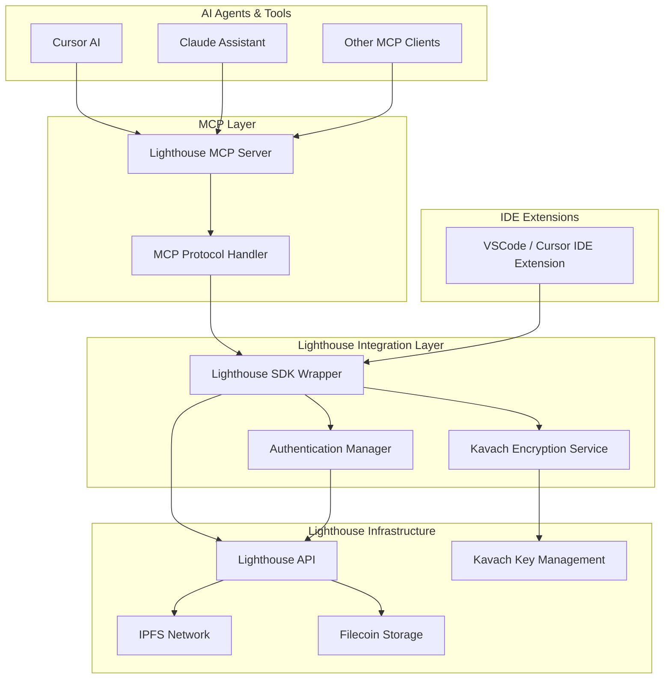

# Lighthouse AI-Native IDE Integration - Technical Proposal

## Executive Summary

This document presents a comprehensive technical proposal for transforming the Lighthouse IDE extension into an AI-native storage integration that positions Lighthouse as the default storage layer for AI agents and modern development tools. The proposal addresses the core feedback from the Lighthouse development team and provides a roadmap for implementing MCP (Model Context Protocol) connectors, Cursor IDE compatibility, and seamless AI agent integration.

## Problem Statement

### Current State

The existing Lighthouse VSCode extension provides basic file upload/download functionality but lacks AI-native integration capabilities. The original extension architecture is designed for manual developer interactions rather than programmatic AI agent workflows.

### Feedback Analysis

The Lighthouse development team identified critical gaps:

- Lack of AI implementation and integrations
- No MCP (Model Context Protocol) connector support
- Limited utility for AI-powered development workflows
- No Cursor IDE compatibility
- Missing hooks for AI agents to interact with Lighthouse programmatically

### Vision

Transform Lighthouse into the default storage backend for AI workflows by enabling seamless interaction between AI agents, development tools, and Lighthouse's decentralized storage infrastructure.

## Technical Architecture Overview

### High-Level Architecture



### Core Components

1. **Lighthouse MCP Server**: Standalone server implementing MCP protocol
2. **Enhanced IDE Extensions**: Cross-compatible extension for VSCode and Cursor
3. **AI Agent Hooks**: Programmatic interfaces for AI agent interactions
4. **Unified SDK Wrapper**: Abstraction layer over Lighthouse and Kavach SDKs

## Component Design Specifications

### 1. Lighthouse MCP Server

#### Overview

A standalone TypeScript/Node.js server implementing the Model Context Protocol to expose Lighthouse functionality to AI agents.

#### Architecture

```typescript
interface LighthouseMCPServer {
  // MCP Protocol Implementation
  protocols: MCPProtocol[];
  capabilities: ServerCapabilities;

  // Lighthouse Integration
  lighthouseClient: LighthouseSDK;
  kavachClient: KavachSDK;
  authManager: AuthenticationManager;

  // Core Services
  fileService: FileOperationService;
  datasetService: DatasetManagementService;
  encryptionService: EncryptionService;
  accessControlService: AccessControlService;
}
```

#### Key Features

- **File Operations**: Upload, download, pin, unpin files via AI commands
- **Dataset Management**: Create, manage, and version ML datasets and models
- **Encryption & Access Control**: Encrypt files, manage key shards, set access conditions
- **Workspace Integration**: Link files to Git repositories and project contexts

#### MCP Tool Definitions

```typescript
const LIGHTHOUSE_MCP_TOOLS = [
  {
    name: "lighthouse_upload_file",
    description:
      "Upload a file to IPFS via Lighthouse with optional encryption",
    inputSchema: {
      type: "object",
      properties: {
        filePath: { type: "string", description: "Path to the file to upload" },
        encrypt: {
          type: "boolean",
          description: "Whether to encrypt the file",
        },
        accessConditions: {
          type: "array",
          description: "Access control conditions",
        },
        tags: { type: "array", description: "Tags for organization" },
      },
      required: ["filePath"],
    },
  },
  {
    name: "lighthouse_create_dataset",
    description: "Create a managed dataset collection with metadata",
    inputSchema: {
      type: "object",
      properties: {
        name: { type: "string", description: "Dataset name" },
        description: { type: "string", description: "Dataset description" },
        files: { type: "array", description: "Files to include in dataset" },
        metadata: { type: "object", description: "Additional metadata" },
      },
      required: ["name", "files"],
    },
  },
  {
    name: "lighthouse_fetch_file",
    description: "Download and optionally decrypt a file from Lighthouse",
    inputSchema: {
      type: "object",
      properties: {
        cid: { type: "string", description: "IPFS CID of the file" },
        outputPath: {
          type: "string",
          description: "Local path to save the file",
        },
        decrypt: {
          type: "boolean",
          description: "Whether to decrypt the file",
        },
      },
      required: ["cid"],
    },
  },
];
```

### 2. Enhanced IDE Extensions

#### Cross-Platform Compatibility Strategy

Develop a shared core module that can be packaged for both VSCode and Cursor IDE:

```typescript
// Core shared module
@lighthouse/ide-core/
├── src/
│   ├── services/          # Business logic services
│   ├── models/            # Data models and interfaces
│   ├── utils/             # Utility functions
│   └── api/               # Lighthouse API wrappers
├── package.json
└── tsconfig.json

// VSCode Extension Package
@lighthouse/vscode-extension/
├── src/
│   ├── extension.ts       # VSCode-specific entry point
│   ├── commands/          # VSCode command handlers
│   └── ui/                # VSCode UI components
└── package.json

// Cursor Extension Package
@lighthouse/cursor-extension/
├── src/
│   ├── extension.ts       # Cursor-specific entry point
│   ├── commands/          # Cursor command handlers
│   └── ui/                # Cursor UI adaptations
└── package.json
```

#### AI Integration Hooks

```typescript
interface AIAgentHooks {
  // Allow AI agents to trigger extension functionality
  onAICommand(command: string, params: any): Promise<any>;

  // Provide context to AI about current workspace
  getWorkspaceContext(): WorkspaceContext;

  // Register custom AI-accessible functions
  registerAIFunction(name: string, handler: Function): void;

  // Stream progress updates to AI
  onProgress(callback: (progress: ProgressUpdate) => void): void;
}

// Implementation in extension
class LighthouseAIIntegration implements AIAgentHooks {
  async onAICommand(command: string, params: any) {
    switch (command) {
      case "upload_dataset":
        return await this.uploadDataset(params);
      case "fetch_model":
        return await this.fetchModel(params);
      case "encrypt_files":
        return await this.encryptFiles(params);
      default:
        throw new Error(`Unknown command: ${command}`);
    }
  }

  getWorkspaceContext(): WorkspaceContext {
    return {
      projectPath: vscode.workspace.rootPath,
      gitInfo: this.getGitInfo(),
      lighthouseFiles: this.getCachedFiles(),
      activeDatasets: this.getActiveDatasets(),
    };
  }
}
```

### 3. Unified SDK Wrapper

#### Purpose

Create a unified interface that abstracts the complexity of Lighthouse SDK and Kavach SDK integration while providing additional AI-friendly functionality.

```typescript
class LighthouseAISDK {
  private lighthouse: LighthouseSDK;
  private kavach: KavachSDK;
  private auth: AuthManager;

  constructor(config: LighthouseConfig) {
    this.lighthouse = new LighthouseSDK(config);
    this.kavach = new KavachSDK(config);
    this.auth = new AuthManager(config);
  }

  // AI-friendly file operations with built-in progress tracking
  async uploadFile(params: UploadParams): Promise<UploadResult> {
    const { filePath, encrypt = false, accessConditions = [] } = params;

    // Generate progress updates for AI consumption
    const progressCallback = (progress: number) => {
      this.emit("progress", {
        operation: "upload",
        progress,
        file: filePath,
      });
    };

    if (encrypt) {
      // Handle encryption workflow
      const { masterKey, keyShards } = await this.kavach.generate();
      const encryptedFile = await this.encryptFile(filePath, masterKey);
      const uploadResult = await this.lighthouse.upload(encryptedFile, {
        onProgress: progressCallback,
      });

      // Save key shards with access conditions
      await this.saveEncryptionKeys(
        uploadResult.Hash,
        keyShards,
        accessConditions
      );

      return {
        cid: uploadResult.Hash,
        encrypted: true,
        accessConditions,
        size: uploadResult.Size,
      };
    } else {
      // Regular upload
      return await this.lighthouse.upload(filePath, {
        onProgress: progressCallback,
      });
    }
  }

  // AI-friendly dataset management
  async createDataset(params: DatasetParams): Promise<DatasetResult> {
    const { name, description, files, metadata = {} } = params;

    // Upload all files in parallel with progress tracking
    const uploadPromises = files.map((file) => this.uploadFile(file));
    const uploadResults = await Promise.all(uploadPromises);

    // Create dataset metadata
    const datasetMetadata = {
      name,
      description,
      files: uploadResults,
      metadata,
      created: new Date().toISOString(),
      version: "1.0.0",
    };

    // Upload dataset metadata
    const metadataResult = await this.uploadFile({
      filePath: this.createTempMetadataFile(datasetMetadata),
      encrypt: false,
    });

    return {
      datasetId: metadataResult.cid,
      files: uploadResults,
      metadata: datasetMetadata,
    };
  }
}
```

## Implementation Roadmap

### Phase 1: Foundation

**Objective**: Establish core MCP server and basic AI integration

#### Deliverables:

1. **Lighthouse MCP Server Core**

   - Basic MCP protocol implementation
   - Lighthouse SDK integration
   - Authentication management
   - File upload/download tools

2. **Core SDK Wrapper**

   - Unified interface for Lighthouse and Kavach SDKs
   - Progress tracking and event emission
   - Error handling and retry logic

3. **Initial Testing Framework**
   - Unit tests for MCP tools
   - Integration tests with mock AI agents
   - Performance benchmarking

#### Technical Specifications:

```typescript
// MCP Server Entry Point
class LighthouseMCPServer extends Server {
  constructor() {
    super(
      {
        name: "lighthouse-storage",
        version: "1.0.0",
      },
      {
        capabilities: {
          tools: {},
          resources: {},
        },
      }
    );

    this.setRequestHandler(ListToolsRequestSchema, this.handleListTools);
    this.setRequestHandler(CallToolRequestSchema, this.handleCallTool);
  }

  private async handleListTools(): Promise<ListToolsResult> {
    return {
      tools: LIGHTHOUSE_MCP_TOOLS,
    };
  }

  private async handleCallTool(
    request: CallToolRequest
  ): Promise<CallToolResult> {
    const { name, arguments: args } = request.params;

    switch (name) {
      case "lighthouse_upload_file":
        return await this.uploadFileTool(args);
      case "lighthouse_create_dataset":
        return await this.createDatasetTool(args);
      default:
        throw new McpError(ErrorCode.MethodNotFound, `Tool not found: ${name}`);
    }
  }
}
```

### Phase 2: Extension Enhancement

**Objective**: Enhance IDE extensions with AI hooks and cross-platform compatibility

#### Deliverables:

1. **Enhanced VSCode Extension**

   - AI agent command interface
   - Workspace context provider
   - Progress streaming to AI
   - MCP server integration

2. **Cursor IDE Extension**

   - Port core functionality to Cursor
   - Cursor-specific UI adaptations
   - AI assistant integration hooks

3. **Cross-Platform Testing**
   - Test suite for both IDEs
   - AI agent integration testing
   - Performance optimization

#### Code Architecture:

```typescript
// Extension AI Interface
export class LighthouseExtension {
  private mcpClient: MCPClient;
  private aiHooks: AIAgentHooks;

  async activate(context: vscode.ExtensionContext) {
    // Initialize MCP client connection
    this.mcpClient = new MCPClient("lighthouse-storage");
    await this.mcpClient.connect();

    // Register AI-accessible commands
    this.registerAICommands(context);

    // Setup context providers for AI
    this.setupContextProviders();

    // Initialize progress streaming
    this.setupProgressStreaming();
  }

  private registerAICommands(context: vscode.ExtensionContext) {
    const commands = [
      vscode.commands.registerCommand(
        "lighthouse.ai.uploadFile",
        this.aiUploadFile
      ),
      vscode.commands.registerCommand(
        "lighthouse.ai.createDataset",
        this.aiCreateDataset
      ),
      vscode.commands.registerCommand(
        "lighthouse.ai.fetchFile",
        this.aiFetchFile
      ),
    ];

    context.subscriptions.push(...commands);
  }

  private async aiUploadFile(params: any) {
    const result = await this.mcpClient.callTool(
      "lighthouse_upload_file",
      params
    );

    // Notify AI of completion
    this.aiHooks.notifyCompletion("upload", result);

    return result;
  }
}
```

### Phase 3: Advanced Features

**Objective**: Implement advanced encryption, access control, and dataset management

#### Deliverables:

1. **Advanced Encryption Features**

   - Threshold encryption with Kavach integration
   - Access condition management
   - Key sharing and revocation

2. **Dataset Management System**

   - Version control for datasets
   - ML model lifecycle management
   - Collaborative dataset sharing

3. **Access Control Integration**
   - Smart contract-based conditions
   - zkTLS proof integration
   - Account delegation support

#### Implementation Example:

```typescript
// Advanced Encryption Service
class AdvancedEncryptionService {
  async encryptWithConditions(
    file: Buffer,
    conditions: AccessCondition[]
  ): Promise<EncryptedFile> {
    // Generate threshold keys
    const { masterKey, keyShards } = await this.kavach.generate(3, 5);

    // Encrypt file
    const encryptedContent = await this.encryptFile(file, masterKey);

    // Set access conditions
    await this.kavach.accessCondition(
      this.auth.address,
      encryptedContent.cid,
      this.auth.token,
      conditions
    );

    // Save key shards with conditions
    await this.kavach.saveShards(
      this.auth.address,
      encryptedContent.cid,
      this.auth.token,
      keyShards
    );

    return {
      cid: encryptedContent.cid,
      encrypted: true,
      conditions,
      keyShards: keyShards.length,
    };
  }
}
```

### Phase 4: Production Optimization

**Objective**: Performance optimization, security hardening, and production deployment

#### Deliverables:

1. **Performance Optimization**

   - Caching strategies for AI workflows
   - Batch operations for large datasets
   - Connection pooling and request optimization

2. **Security Hardening**

   - Authentication token management
   - Secure key storage for AI agents
   - Rate limiting and abuse prevention

3. **Production Deployment**
   - CI/CD pipelines
   - Documentation and tutorials
   - Marketplace distribution

## API Specifications

### MCP Tool Interface

#### File Upload Tool

```json
{
  "name": "lighthouse_upload_file",
  "description": "Upload a file to IPFS via Lighthouse with optional encryption",
  "inputSchema": {
    "type": "object",
    "properties": {
      "filePath": {
        "type": "string",
        "description": "Path to the file to upload"
      },
      "encrypt": {
        "type": "boolean",
        "description": "Whether to encrypt the file",
        "default": false
      },
      "accessConditions": {
        "type": "array",
        "description": "Array of access control conditions",
        "items": {
          "type": "object",
          "properties": {
            "type": { "type": "string" },
            "condition": { "type": "string" },
            "value": { "type": "string" }
          }
        }
      },
      "tags": {
        "type": "array",
        "description": "Tags for organization",
        "items": { "type": "string" }
      }
    },
    "required": ["filePath"]
  }
}
```

#### Dataset Creation Tool

```json
{
  "name": "lighthouse_create_dataset",
  "description": "Create a managed dataset collection with metadata",
  "inputSchema": {
    "type": "object",
    "properties": {
      "name": {
        "type": "string",
        "description": "Dataset name"
      },
      "description": {
        "type": "string",
        "description": "Dataset description"
      },
      "files": {
        "type": "array",
        "description": "Array of file paths to include",
        "items": { "type": "string" }
      },
      "metadata": {
        "type": "object",
        "description": "Additional metadata",
        "properties": {
          "version": { "type": "string" },
          "author": { "type": "string" },
          "license": { "type": "string" }
        }
      },
      "encrypt": {
        "type": "boolean",
        "description": "Whether to encrypt the dataset",
        "default": false
      }
    },
    "required": ["name", "files"]
  }
}
```

### AI Agent Integration Examples

#### Cursor AI Integration

```typescript
// Example of how Cursor AI would interact with Lighthouse
const cursorLighthouseIntegration = {
  async uploadDataset(userPrompt: string, files: string[]) {
    const mcpResponse = await this.mcp.callTool("lighthouse_create_dataset", {
      name: extractDatasetName(userPrompt),
      description: extractDescription(userPrompt),
      files: files,
      encrypt: shouldEncrypt(userPrompt),
      metadata: {
        author: this.userContext.name,
        created: new Date().toISOString(),
      },
    });

    return `Dataset uploaded successfully! CID: ${mcpResponse.datasetId}`;
  },

  async fetchModel(userPrompt: string) {
    const cid = extractCID(userPrompt);

    const result = await this.mcp.callTool("lighthouse_fetch_file", {
      cid: cid,
      outputPath: `./models/${generateFileName(cid)}`,
      decrypt: true,
    });

    return `Model downloaded to: ${result.filePath}`;
  },
};
```

#### Claude Assistant Integration

```typescript
// Example of Claude integration via MCP
const claudeLighthouseTools = [
  {
    name: "store_analysis_data",
    description: "Store analysis results and datasets to Lighthouse",
    implementation: async (params: any) => {
      return await lighthouseMCP.callTool("lighthouse_upload_file", {
        filePath: params.dataPath,
        encrypt: params.sensitive || false,
        tags: ["analysis", "claude-generated"],
      });
    },
  },
  {
    name: "retrieve_shared_dataset",
    description: "Retrieve a shared dataset for analysis",
    implementation: async (params: any) => {
      return await lighthouseMCP.callTool("lighthouse_fetch_file", {
        cid: params.cid,
        outputPath: "./temp/dataset.json",
        decrypt: params.encrypted || false,
      });
    },
  },
];
```

## Security Considerations

### Authentication & Authorization

1. **Multi-layer Authentication**

   - API key authentication for Lighthouse services
   - Wallet-based authentication for encryption operations
   - JWT token management with refresh cycles

2. **Key Management Security**
   - Secure storage of authentication tokens
   - Hardware wallet integration support
   - Key rotation and revocation capabilities

### Data Protection

1. **Encryption at Rest and Transit**

   - AES-256 encryption for sensitive data
   - TLS 1.3 for all network communications
   - Threshold cryptography for distributed key management

2. **Access Control**
   - Smart contract-based access conditions
   - Time-based access expiration
   - Revocable access permissions

### AI Agent Security

1. **Sandboxed Operations**

   - Restrict AI agents to authorized file operations
   - Rate limiting and quota management
   - Audit logging for all AI-initiated actions

2. **Secure Communication**
   - MCP protocol security compliance
   - Encrypted communication channels
   - Authentication verification for all requests

## Performance Considerations

### Optimization Strategies

1. **Caching Architecture**

   ```typescript
   class LighthouseCacheManager {
     private metadataCache = new LRUCache(1000);
     private fileContentCache = new LRUCache({
       max: 100,
       maxSize: 100 * 1024 * 1024,
     });

     async getFileMetadata(cid: string): Promise<FileMetadata> {
       if (this.metadataCache.has(cid)) {
         return this.metadataCache.get(cid);
       }

       const metadata = await this.lighthouse.getFileInfo(cid);
       this.metadataCache.set(cid, metadata);
       return metadata;
     }
   }
   ```

2. **Batch Operations**

   ```typescript
   class BatchOperationManager {
     async uploadBatch(files: FileUpload[]): Promise<BatchResult> {
       // Process files in parallel with concurrency limit
       const results = await Promise.allSettled(
         files.map((file) => this.uploadWithRetry(file))
       );

       return this.processBatchResults(results);
     }
   }
   ```

### Performance Targets

| Metric                      | Target       | Measurement                     |
| --------------------------- | ------------ | ------------------------------- |
| MCP Server Startup          | < 2 seconds  | Time to ready state             |
| File Upload (1MB)           | < 5 seconds  | Including encryption if enabled |
| Dataset Creation (10 files) | < 30 seconds | Parallel processing             |
| AI Command Response         | < 1 second   | For metadata operations         |
| Memory Usage                | < 100MB      | Peak memory consumption         |

## Testing Strategy

### Unit Testing

```typescript
describe("LighthouseMCPServer", () => {
  let server: LighthouseMCPServer;
  let mockLighthouse: jest.Mocked<LighthouseSDK>;

  beforeEach(() => {
    mockLighthouse = createMockLighthouseSDK();
    server = new LighthouseMCPServer(mockLighthouse);
  });

  test("should upload file via MCP tool", async () => {
    const result = await server.handleCallTool({
      method: "tools/call",
      params: {
        name: "lighthouse_upload_file",
        arguments: { filePath: "/test/file.txt" },
      },
    });

    expect(result.content).toContain("uploaded successfully");
    expect(mockLighthouse.upload).toHaveBeenCalledWith("/test/file.txt");
  });
});
```

### Integration Testing

```typescript
describe("AI Agent Integration", () => {
  test("should handle Cursor AI upload request", async () => {
    const cursorRequest = {
      command: "upload_dataset",
      files: ["./data/model.json", "./data/weights.bin"],
      encrypt: true,
    };

    const result = await aiIntegration.processCommand(cursorRequest);

    expect(result.success).toBe(true);
    expect(result.datasetId).toBeDefined();
    expect(result.encrypted).toBe(true);
  });
});
```

### End-to-End Testing

```typescript
describe("Full Workflow Tests", () => {
  test("complete AI dataset workflow", async () => {
    // 1. AI creates dataset
    const dataset = await createDatasetViaMCP({
      name: "test-dataset",
      files: ["./test/data.csv"],
    });

    // 2. AI shares dataset with conditions
    await addAccessConditions(dataset.id, [
      {
        type: "token_balance",
        token: "0x...",
        threshold: "100",
      },
    ]);

    // 3. Another AI agent retrieves dataset
    const retrieved = await fetchDatasetViaMCP(dataset.id);

    expect(retrieved.files).toHaveLength(1);
  });
});
```

## Deployment Strategy

### Package Distribution

1. **NPM Packages**

   - `@lighthouse/mcp-server`: Standalone MCP server
   - `@lighthouse/ide-core`: Shared extension core
   - `@lighthouse/vscode-extension`: VSCode marketplace package
   - `@lighthouse/cursor-extension`: Cursor IDE package

2. **Container Distribution**

   ```dockerfile
   FROM node:18-alpine

   WORKDIR /app
   COPY package*.json ./
   RUN npm ci --only=production

   COPY dist ./dist

   EXPOSE 3000
   CMD ["node", "dist/mcp-server.js"]
   ```

### CI/CD Pipeline

```yaml
# .github/workflows/deploy.yml
name: Deploy Lighthouse AI Integration

on:
  push:
    branches: [main]
    tags: ["v*"]

jobs:
  test:
    runs-on: ubuntu-latest
    steps:
      - uses: actions/checkout@v3
      - uses: actions/setup-node@v3
      - run: npm ci
      - run: npm test
      - run: npm run lint

  build:
    needs: test
    runs-on: ubuntu-latest
    steps:
      - uses: actions/checkout@v3
      - uses: actions/setup-node@v3
      - run: npm ci
      - run: npm run build
      - run: npm run package

  deploy:
    needs: build
    runs-on: ubuntu-latest
    if: startsWith(github.ref, 'refs/tags/v')
    steps:
      - run: npx vsce publish
      - run: docker push lighthouse/mcp-server:${{ github.ref_name }}
```

## Success Metrics

### Technical Metrics

- **MCP Server Uptime**: >99.9%
- **Average Response Time**: <500ms for standard operations
- **Error Rate**: <1% for all MCP tool calls
- **Memory Efficiency**: <100MB average usage

### Adoption Metrics

- **Extension Installs**: Track VSCode and Cursor installation rates
- **AI Agent Usage**: Monitor MCP tool call frequency
- **Dataset Creation**: Track AI-initiated dataset uploads
- **Community Engagement**: GitHub stars, issues, contributions

### Business Metrics

- **Developer Onboarding**: Reduce time-to-first-upload via AI
- **Storage Usage**: Increase in AI-generated content storage
- **Integration Adoption**: Number of AI tools using Lighthouse

## Possible Future Roadmap

### Phase 5: Advanced AI Features

- **Semantic Search**: Vector embeddings for AI content discovery
- **Automated Optimization**: AI-driven file compression and storage optimization
- **Smart Caching**: Predictive caching based on AI usage patterns

### Phase 6: Ecosystem Expansion

- **GitHub Copilot Integration**: Direct integration with GitHub's AI tools
- **JetBrains IDE Support**: Extend to IntelliJ, PyCharm, etc.
- **Web-based AI Tools**: Browser extension for web-based AI platforms

### Phase 7: Enterprise Features

- **Team Management**: Multi-user workspaces with role-based access
- **Compliance Tools**: Audit trails and regulatory compliance features
- **Enterprise SSO**: Integration with corporate identity providers

## Conclusion

This technical proposal presents a comprehensive approach to transforming Lighthouse into the default storage layer for AI-powered development workflows. By implementing MCP protocol support, enhancing IDE extensions with AI hooks, and providing seamless integration with modern AI tools like Cursor, we can position Lighthouse at the forefront of the AI-native development ecosystem.

The phased implementation approach ensures steady progress while allowing for iterative feedback and optimization.
